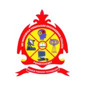

TCS Inframind Prototype &amp; Video Submission Sri Manakula Vinayagar Engineering College

# **INFRAMIND SEASON-04**

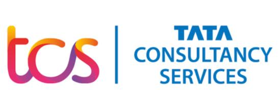

## **Round 2 Submission Document**

#### Sri Manakula Vinayagar Engineering College, Puducherry

Maheshwari. B DT20184410150 [mahibaskaran08@gmail.com](mailto:mahibaskaran08@gmail.com)

Video Presentation Link

https://youtu.be/Oy-fhSi3BJs

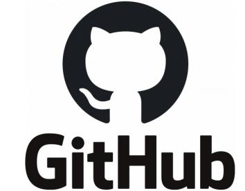

GitHub Link

TCS Inframind Prototype &amp; Video Submission Sri Manakula Vinayagar Engineering College

**CONVERTING TEXTED IMAGE INTO TEXT**

**PROBLEM STATEMENT:**

With Superior Customer Experience of paramount importance for all business operations, it has become imperative to treat this process with utmost care infused with latest AI/ML technologies. It is expected to drive the customer experience to a new level of awareness and acceptance. The sea of technologies changes, have also brought to the table, newer and better aspects towards our customer experience. These customers include the internal as well as external customers.

Keeping the problem statement in mind, I have successfully developed a web application that does the job.

**TECHNOLOGY USED:**

1. **Frontend**

- Flask Framework
- HTML

1. **Backend**

- Python
- Libraries - Flask, Open CV, Tesseract, Werkzeug

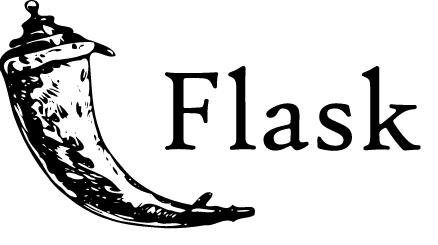 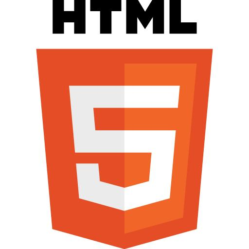 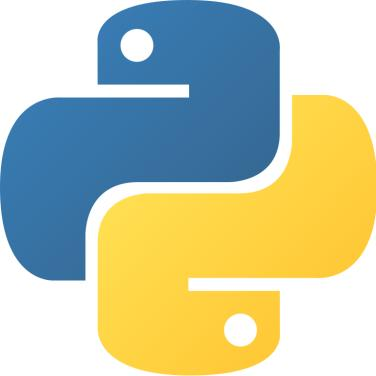

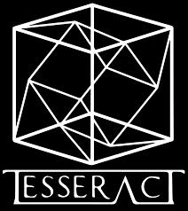 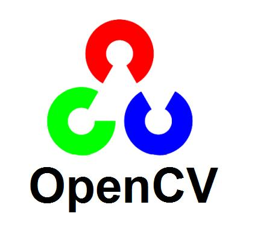

TCS Inframind Prototype &amp; Video Submission Sri Manakula Vinayagar Engineering College

**FLASK FRAMEWORK:**

Flask Framework is the web framework. It provides the libraries, technologies and tools which allow to built the web application. The Flask Framework is used for the frontend and backend. This web application can be some website, web pages, web based application.

**HTML:**

HTML is the Hypertext Mark-up Language. It is used to for the web development, this HTML code is used for the structure the web pages and content. [HTML elements](https://en.wikipedia.org/wiki/HTML_element) are the building blocks of HTML pages. With HTML constructs, [images](https://en.wikipedia.org/wiki/HTML_element#Images_and_objects) and other objects such as [interactive forms](https://en.wikipedia.org/wiki/Fieldset) may be embedded into the rendered page.

**PYTHON:**

Python is an interpreted, object-oriented, high-level programming language. The python language is used to develop the code for the web application. Python uses [dynamic typing](https://en.wikipedia.org/wiki/Dynamic_typing) and a combination of [reference counting](https://en.wikipedia.org/wiki/Reference_counting) and a cycle-detecting garbage collector for [memory management](https://en.wikipedia.org/wiki/Memory_management).  It also features dynamic [name resolution](https://en.wikipedia.org/wiki/Name_resolution_(programming_languages)) ([late binding](https://en.wikipedia.org/wiki/Late_binding)), which binds method and variable names during program execution.

**TESSERACT:**

Tesseract is an optical character recognition engine for various operating systems. It can be used directly, for programming using an API to extract printed text from images. Tesseract is compatible with many programming languages and frameworks through wrappers. Tesseract is compatible with many programming languages and frameworks through wrappers.

**OPEN-CV:**

Open-CV is a library function of Python  bindings designed to solve computer vision problems. It is the open source for image processing and now it plays a major role in real-time operation which is very important in today&#39;s systems. By using it, one can process images to identify the text.

**WIKZEUG:**

Wikzeug is the comprehensive web application library. It is a simple collection of various utilities for WSGI applications and has become one of the most advanced WSGI utility libraries. It is handled while providingmore structure and patterns for defining powerful applications.

 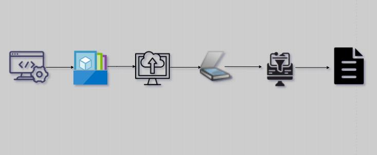 

**Processing**

**Document Output**

**Document Input**

Recognising the Text

Output as Text

Scanning the Image

Uploading the Image

Images from folder

Web Application

TCS Inframind Prototype &amp; Video Submission Sri Manakula Vinayagar Engineering College

**ARCHITECTURE :**

The Architecture for this web application is described below,

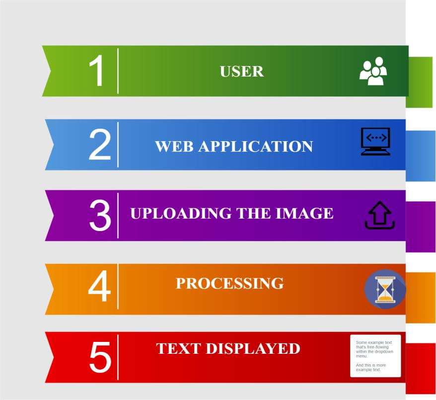

**COST SAVING:**

There&#39;s no cost to develop this application for the Enterprise –AI. As I where developed on the pythonanywhere platform, which is simply fast and free. And it can turn the texted image into simple text format.

**BRIEF DESCRIPTION OF SOLUTION:**

The Web application is developed to convert the printed characters in the photograph into the text format. This web application consider only png, jpg and jpeg formats. This application is to recognize the text inside the images by scanning the photos. This web application is used to convert any kind of printed images into the text data. For the entire process of image conversion from the image it takes not much a time, it takes less than a minute and quickly recognize the exact text. The code was developed for creating an application and for converting the text image. To create a code, first we have to code for converting the selected image into the black and white. The next way is to reduce the noise. In the next step is Tesseract is used for the character recognition and for the conversion of the image to the string by using an AI. Finally, we have to upload the kind of formats this web application supports. The developed web application is Maheshwari.pythonanywhere.com , this webpage is to convert the printed image into text. The steps to upload the image,

1. Select **Choose File** option.
2. Drag the **Image** from the files.
3. Click **Submit** button.
4. To convert another picture click **Convert Image to Text again** command.

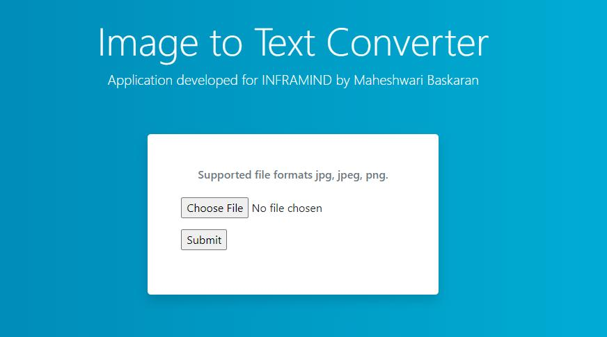

TCS Inframind Prototype &amp; Video Submission Sri Manakula Vinayagar Engineering College

**WORKFLOW:**

**APPLICATION UI:**

**Fig.** Home page of our Application

TCS Inframind Prototype &amp; Video Submission Sri Manakula Vinayagar Engineering College

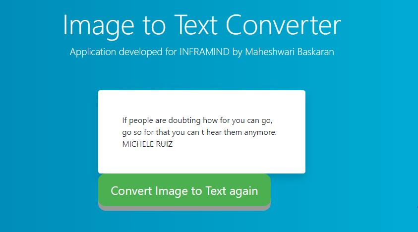

**Fig.** After the image is converted as text

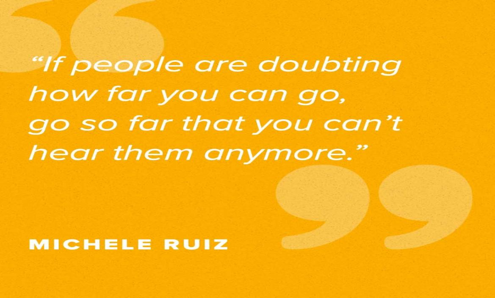

**Fig.** Actual image uploaded to the application

**CONCLUSION:**

This web application can be further refined for converting the image into the text. This application make use for the large texted image into text document in a simple way. It is has the fantastic future in the AI. This application is simply amazing and we hope you really liked the solution proposed for the use of Enterprise AI. Make sure you watch the Video Presentation, the link for which is provided at the beginning of this document.

TCS Inframind Prototype &amp; Video Submission Sri Manakula Vinayagar Engineering College

# THANK

# YOU
